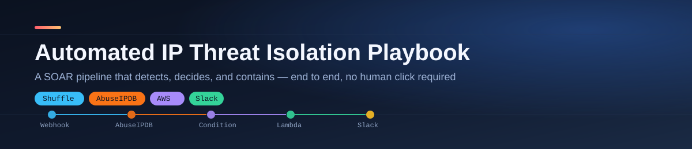
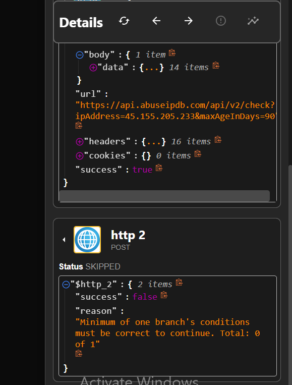
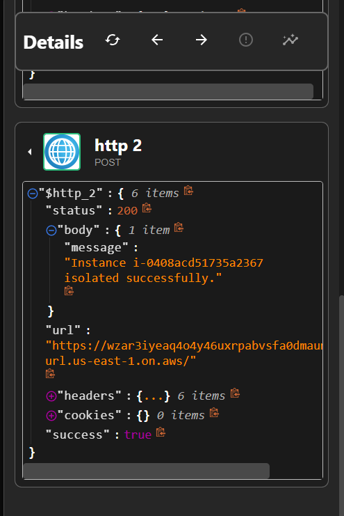
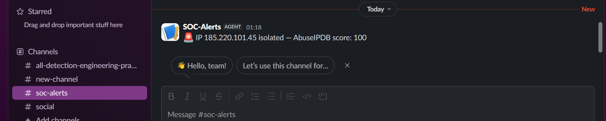
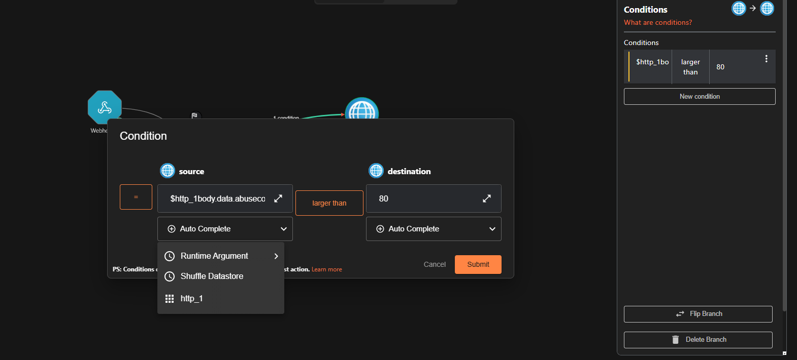

<br/>

An automated **SOAR (Security Orchestration, Automation & Response)** playbook, built end-to-end on a free-tier stack, that takes a suspicious IP from a raw alert to a contained, notified incident with zero human clicks in between.

> **The chain:** Webhook alert → live threat-intel lookup (AbuseIPDB) → conditional decision → automated cloud isolation (AWS Lambda + EC2 security groups) → Slack notification.

Every part of this is real, working infrastructure — a live AWS account, a real Lambda function, a real security group swap, a real Slack channel. Nothing here is mocked or simulated.

---

## Why this project

Most "SOAR demo" tutorials show the happy path and stop there. This repo intentionally keeps the messy middle too — the wrong API actions, the malformed URLs, the silent bugs — because that debugging trail is the actual skill a detection engineer uses day to day. See [`docs/TROUBLESHOOTING.md`](docs/TROUBLESHOOTING.md) for the full list of real issues hit and fixed while building this.

## What it does

| Stage | Tool | Job |
|---|---|---|
| **1. Trigger** | Shuffle webhook | Receives a suspicious IP alert (simulates a SIEM/firewall push) |
| **2. Enrich** | AbuseIPDB API | Looks up the IP's live abuse confidence score (0–100) |
| **3. Decide** | Shuffle condition branch | Only continues if `abuseConfidenceScore > 80` |
| **4. Contain** | AWS Lambda + EC2 | Swaps the target instance's security group to a zero-rule quarantine group |
| **5. Notify** | Slack webhook | Posts the isolated IP and its score to `#soc-alerts` |

## Proof it actually works — both branches tested

The condition was verified in **both directions**, not just the success path:

<table>
<tr>
<td width="50%">

**Low-risk IP → correctly skipped**

`45.155.205.233` scored **7/100**. The isolation step never ran.



</td>
<td width="50%">

**High-risk IP → correctly isolated**

`185.220.101.45` (a known Tor exit node) scored **100/100**. Lambda fired and isolated the instance.



</td>
</tr>
</table>

**The resulting Slack alert:**



## The workflow, built in Shuffle



Five nodes: a webhook trigger, an HTTP call to AbuseIPDB, a scored condition branch, an HTTP call to a Lambda Function URL, and a Slack post — all chained with live variable references (`$exec.suspicious_ip`, `$http_1.body.data.abuseConfidenceScore`) so the same workflow adapts to whatever IP comes in.

## Tech stack

- **Shuffle** (shuffler.io) — free-tier cloud SOAR / no-code automation engine
- **AbuseIPDB API** — real-time IP reputation and abuse-confidence scoring
- **AWS** (free tier) — EC2 test target, IAM, Lambda, security groups
- **Slack** — incoming webhook for analyst-facing alerting
- **Python 3.12 / boto3** — the Lambda isolation logic

## Repo structure

```
├── README.md                    ← you are here
├── lambda/isolate_ec2.py         final, working Lambda isolation function
├── aws-setup/                    everything AWS: what was built, and why
│   ├── README.md
│   └── screenshots/
├── docs/
│   └── TROUBLESHOOTING.md        every real bug hit, root cause, and fix
├── screenshots/                  full evidence trail, organized by phase
│   ├── 01-aws-infrastructure-setup/
│   ├── 02-shuffle-workflow-build/
│   ├── 03-testing-and-debugging/
│   └── 04-final-verified-results/
└── screenshots-archive.zip       the full screenshot set, zipped for download
```

## Design notes / things I'd change for production

- The Lambda's IAM role currently uses `AmazonEC2FullAccess` for lab simplicity — a real deployment would scope this to just `ec2:ModifyInstanceAttribute` and `ec2:DescribeInstances` on tagged resources.
- The webhook has no authentication header enabled — production would require a shared secret or signed request.
- The Lambda Function URL uses `AuthType: NONE` for the same reason — production should use IAM auth or place it behind an API Gateway with request validation.
- The IP → instance mapping is hardcoded for this single-instance lab; a real environment would resolve this via asset inventory / CMDB lookup.

These trade-offs are intentional and called out here rather than hidden — a lab environment optimizes for provable functionality first.
