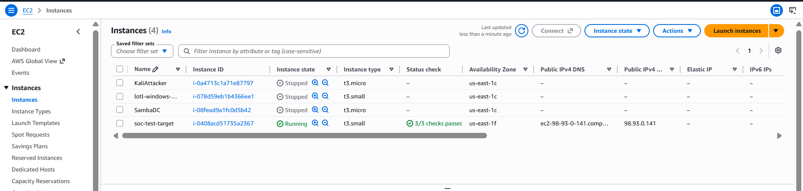
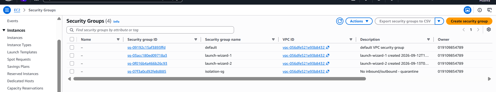
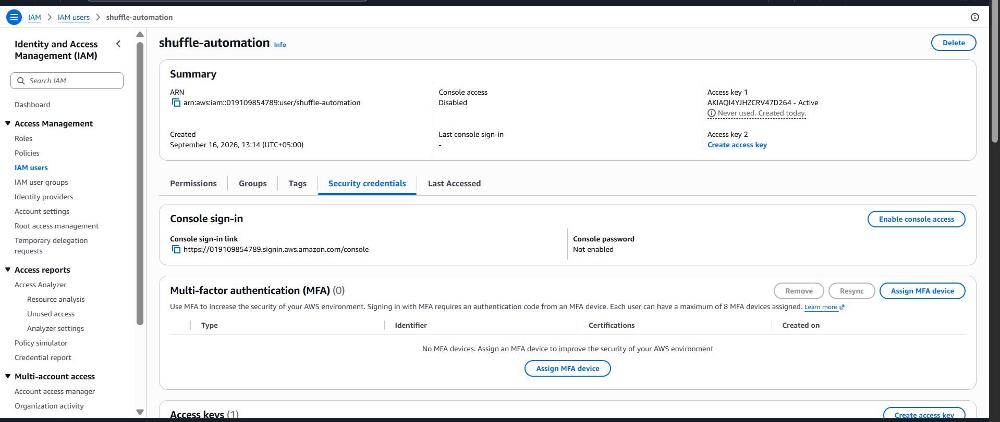
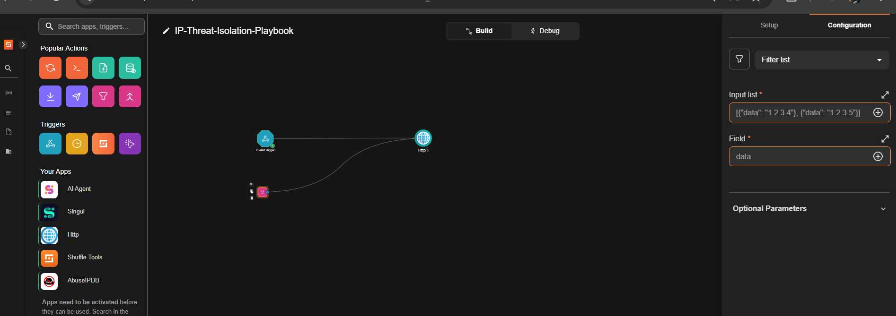
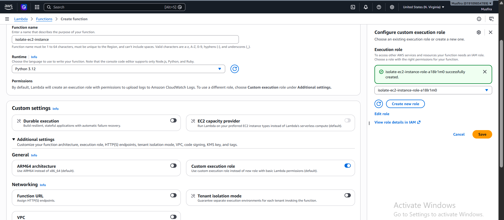
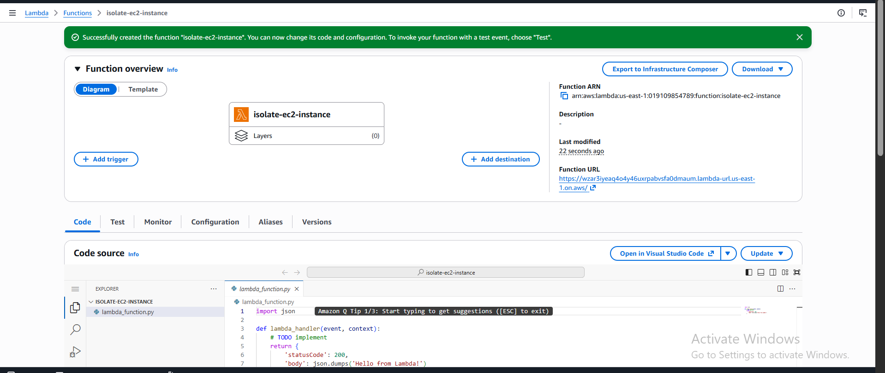
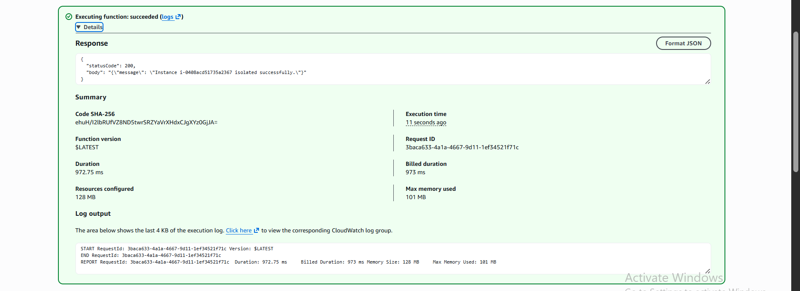

# AWS Setup — What Was Built, and Why

This playbook needed a realistic "victim machine" to isolate, and a way to actually perform that isolation from an external automation tool. Everything below was built on the **AWS Free Tier**.

## 1. The target instance

A single `t3.micro` EC2 instance (`soc-test-target`, Amazon Linux 2023) stands in for a compromised endpoint. It doesn't run any special software — its only job is to have a security group that the Lambda function can swap.

> **Note caught during setup:** the instance was first launched as `t3.small`, which is *not* free-tier eligible. It was stopped and changed to `t3.micro` before continuing — a good reminder to always double check the instance type after launch, not just at the wizard step.

## 2. The isolation security group (`isolation-sg`)

This is the core containment mechanism. Rather than terminating or stopping the instance (too destructive, and it destroys forensic state), the playbook **swaps the instance's security group** to one with **zero inbound and zero outbound rules**.

**Why this approach, specifically:**

- It's non-destructive — the instance keeps running, memory and disk state are preserved for later forensics, but it can no longer talk to anything on the network (including any C2 channel).
- It's instantly reversible — swap the security group back and the instance is live again, no rebuild needed.
- It mirrors what real EDR/NDR tools actually do under the hood when they "isolate" a host — most enterprise EDR agents implement network isolation via exactly this kind of allow-list collapse, not by powering the machine off.
- AWS's default outbound-allow-all rule was explicitly removed when creating this group — by default AWS adds an "allow all outbound" rule to every new security group, which would have silently defeated the whole point of isolation if left in place.

## 3. The IAM user for Shuffle

Shuffle can't be trusted with your root AWS credentials, so a scoped IAM user (`shuffle-automation`) was created specifically for this automation, with only programmatic (access key) credentials — no console login.

In the end, this user's credentials weren't actually needed by Shuffle directly — see the next section for why the design shifted to a Lambda Function URL instead. It's kept here as the intended pattern for a case where Shuffle *does* need to call AWS APIs directly with SigV4-signed requests (e.g. via a proper AWS app/connector).

## 4. Why a Lambda function instead of a direct AWS API call

Shuffle's app catalog has no dedicated "modify EC2 security group" action, and AWS's raw REST API requires **SigV4 request signing** — not something a generic HTTP node can do without a lot of manual cryptographic work. Rather than fight that, the isolation logic was moved into a small **AWS Lambda function**, fronted by a public **Function URL**, so Shuffle only ever needs to make a plain `POST` request with a JSON body.

This is also a more realistic architecture: in production SOAR setups, the automation platform very often calls a lightweight internal function/API rather than holding broad cloud credentials itself — it keeps the blast radius of a compromised SOAR platform much smaller.

**Lambda configuration:**
- Runtime: Python 3.12
- Trigger: Function URL, `AuthType: NONE` (lab simplicity — see main README's production notes)
- Execution role permissions: `AmazonEC2FullAccess` (lab scope — production should be narrowed to `ec2:ModifyInstanceAttribute` + `ec2:DescribeInstances`)
- Timeout: increased from the 3-second default to 10 seconds (the EC2 API call plus cold start exceeded 3s — see [`../docs/TROUBLESHOOTING.md`](../docs/TROUBLESHOOTING.md))

**Verified working, end to end:**

The function source lives at [`../lambda/isolate_ec2.py`](../lambda/isolate_ec2.py).

## 5. Region consistency

Everything — the EC2 instance, the security groups, the IAM user, the Lambda function — was deliberately kept in **`us-east-1` (N. Virginia)**. Cross-region mismatches are a common real-world source of "why can't my automation find my instance" bugs, so this was checked explicitly rather than assumed.
