# Troubleshooting Log

This is the real debugging trail from building this playbook — every issue is genuine, hit in order, with the root cause and the actual fix. Kept here deliberately: knowing *why* something broke is usually worth more than the final working diagram.

---

### 1. `curl` in PowerShell isn't real curl

**Symptom:** `curl -X POST ... -d '...'` failed with `A parameter cannot be found that matches parameter name 'X'`.

**Root cause:** PowerShell aliases `curl` to `Invoke-WebRequest`, which uses completely different flag syntax (no `-X`, no `-d`).

**Fix:** Either call `curl.exe` explicitly (the real curl binary shipped with Windows), or use PowerShell's native `Invoke-RestMethod -Uri ... -Method Post -ContentType ... -Body ...`.

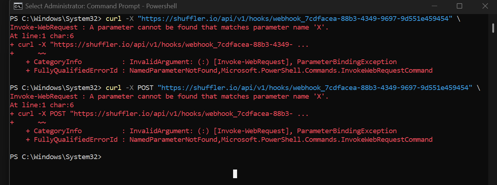

---

### 2. Wrong AbuseIPDB action selected

**Symptom:** AbuseIPDB node returned `401` with an `errors` array.

**Root cause:** The action dropdown defaulted to `get_check_cidr` (for checking an IP *range*), not the single-IP check action.

**Fix:** Changed the action to `get_check_ip`.

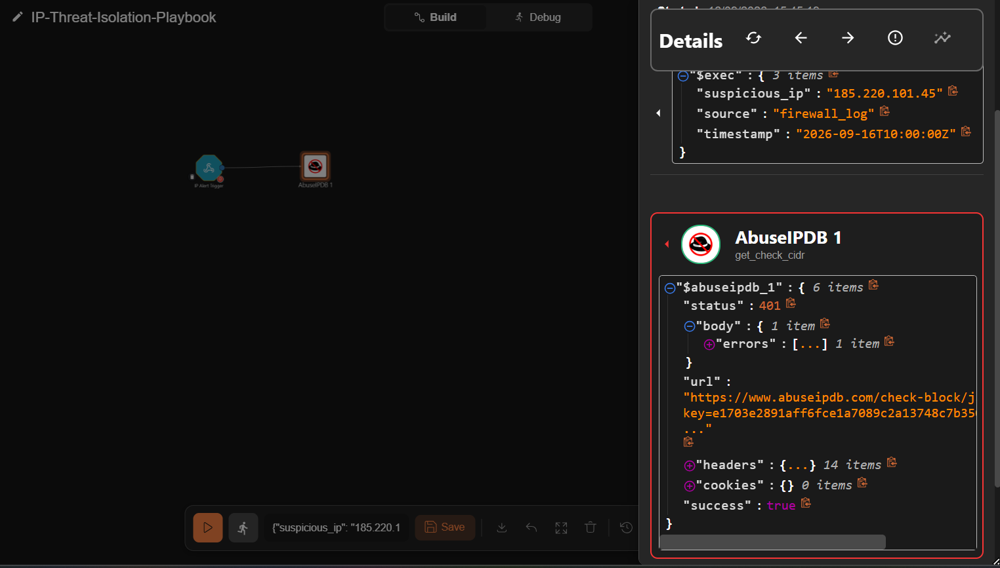

---

### 3. AbuseIPDB auth object missing its base URL

**Symptom:** Still `401` after fixing the action; the outgoing request URL showed the API key appended directly with no `?`, e.g. `.../check/key=abc123...`.

**Root cause:** The app's authentication object had the API key saved, but its **`url`** field (the API base endpoint) was left blank.

**Fix:** Set the auth object's `url` field to `https://api.abuseipdb.com/api/v2/`.

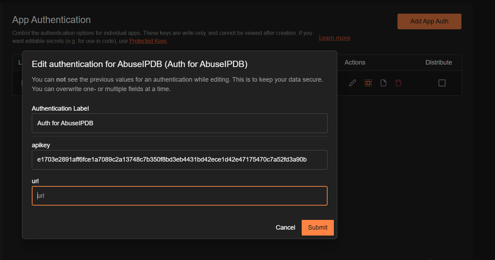

---

### 4. AbuseIPDB's app abstraction fighting the request format

**Symptom:** After the above fixes, the app-specific AbuseIPDB node alternated between `401`s and a hard **timeout** — never a clean success.

**Root cause:** AbuseIPDB's real API expects the key as a `Key:` **header**, not a query parameter — and the pre-built Shuffle app for AbuseIPDB was not constructing the request this way reliably.

**Fix:** Abandoned the dedicated AbuseIPDB app node entirely and rebuilt the call using Shuffle's **generic HTTP node**, with full manual control:
- `GET https://api.abuseipdb.com/api/v2/check?ipAddress=<ip>&maxAgeInDays=90`
- Header: `Key: <api_key>`

This is arguably the more valuable outcome — it demonstrates understanding the raw REST contract rather than depending on an abstraction layer.

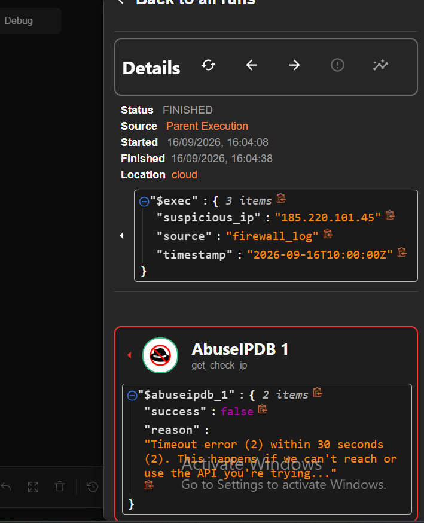

---

### 5. Query string silently stripped from the HTTP node's URL field

**Symptom:** Generic HTTP node returned `422 — "The ip address field is required"`, and the logged outgoing `url` showed only `https://api.abuseipdb.com/api/v2/check` — everything after `?` had vanished.

**Root cause:** Isolated by testing a fully hardcoded URL first (no variables at all), which worked — proving the query-string syntax itself was fine. The failure was specifically tied to how the `$exec.suspicious_ip` variable was inserted.

**Fix:** Rebuilt the field and inserted the variable **using the field's own autocomplete/variable picker** (typing `$` and selecting from the dropdown) instead of hand-typing the reference. The picker inserts Shuffle's correct internal token; hand-typed text was apparently not being resolved as a variable at all in this position.

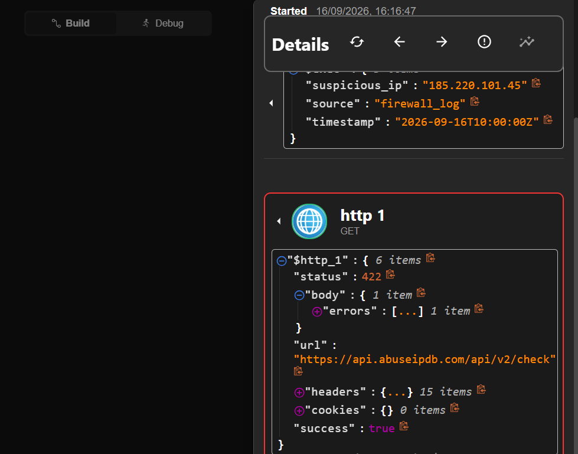
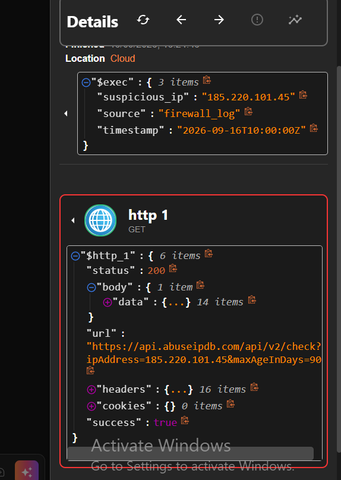

---

### 6. The "dynamic" IP field was actually still hardcoded

**Symptom:** After the fix above, a test appeared to succeed — but sending a **second, different** IP through the webhook still returned data for the **first** IP.

**Root cause:** The URL field still contained a stale, manually-typed value from an earlier debugging step; it looked like a working variable reference but wasn't actually re-evaluating per execution.

**Fix:** Never trust a single passing test when a dynamic reference is involved. Verified properly by sending **three different IPs** through the same webhook across separate curl calls and confirming the AbuseIPDB `url` field changed to match each one before accepting the wiring as correct.

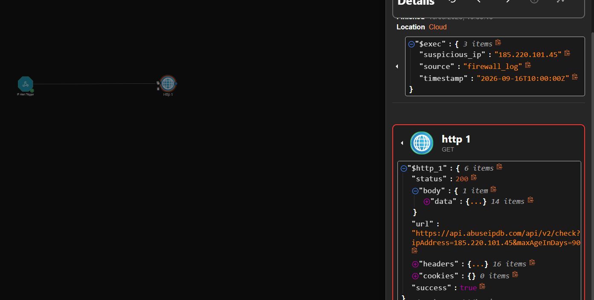
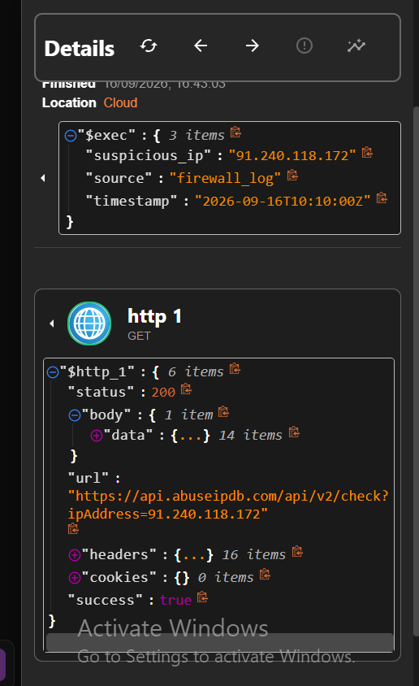

**Lesson:** a single green checkmark is not proof of a dynamic pipeline — proof requires varying the input and confirming the output actually moves with it.

---

### 7. Lambda Function URL body isn't auto-parsed

**Symptom:** The Lambda always returned `400 — "instance_id is required"`, even with a correctly-formed JSON body being sent from Shuffle.

**Root cause:** AWS Lambda Function URLs deliver the POST body as a **raw JSON string** inside `event['body']` — it is **not** merged into the top-level `event` dict. The original code read `event.get('instance_id')` directly, which will always be `None`.

**Fix:**
```python
body = json.loads(event.get('body', '{}'))
instance_id = body.get('instance_id')
```

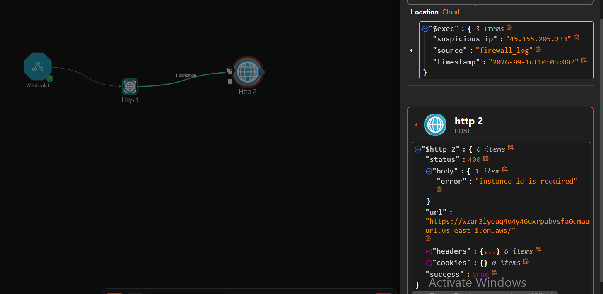
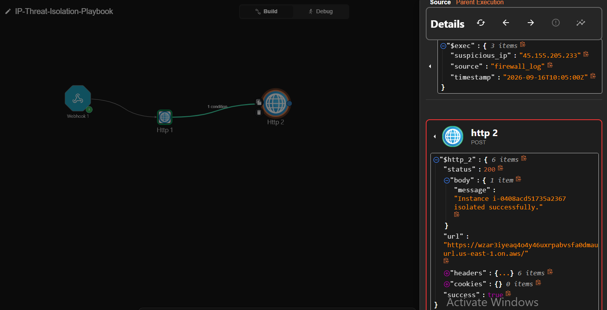

---

### 8. Lambda timeout (default 3 seconds)

**Symptom:** `Sandbox.Timeout — Task timed out after 3.00 seconds`.

**Root cause:** Lambda's default timeout is 3 seconds; the combination of cold start + the `boto3` EC2 API call occasionally exceeded that.

**Fix:** Increased the function timeout to 10 seconds under **Configuration → General configuration**.

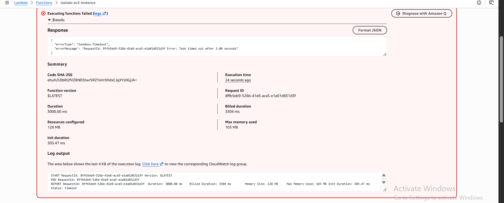

---

### 9. Lambda execution role missing EC2 permissions

**Symptom:** `UnauthorizedOperation — You are not authorized to perform: ec2:ModifyInstanceAttribute`.

**Root cause:** When the function was created, AWS auto-generated a **new** execution role with only basic CloudWatch logging permissions — not the EC2 permissions that had been planned for a different IAM user.

**Fix:** Opened the role in IAM (via Lambda → Configuration → Permissions → role link) and attached `AmazonEC2FullAccess` directly to that role.

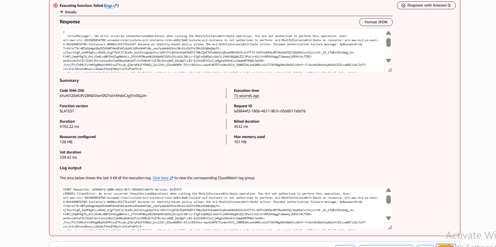


---

### 10. No native "modify EC2 security group" action in Shuffle

**Symptom:** Searching "AWS" in Shuffle's app catalog surfaced only S3, Security Lake, Price List Service, and Network Firewall — nothing for EC2 instance/security-group management.

**Root cause:** Shuffle simply doesn't ship a pre-built connector for this specific EC2 action, and AWS's raw API requires SigV4 signing that a generic HTTP node can't perform.

**Fix:** See [`../aws-setup/README.md`](../aws-setup/README.md) — moved the isolation logic into an AWS Lambda function behind a Function URL, called from Shuffle as a plain HTTP POST.

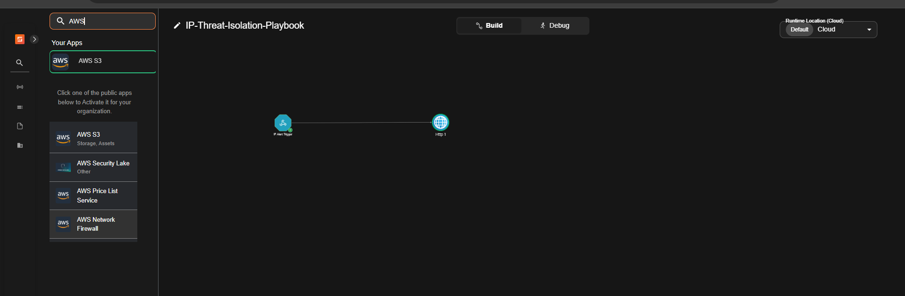

---

### 11. Confusing "Filter list" with a real conditional branch

**Symptom:** Built what looked like an IF node, but it was actually a **Filter list** action — meant for filtering arrays, not gating a single value.

**Root cause:** Misread Shuffle's UI; conditions in Shuffle are **not** a separate node type at all.

**Fix:** Per Shuffle's own documentation, a condition is a property of the **branch/line connecting two nodes** — clicking directly on the connector between two already-linked nodes opens the condition editor. Deleted the Filter list node and set the condition (`abuseConfidenceScore > 80`) on the actual connecting line instead.

---

### 12. The condition's "Try it" tester evaluates against fake placeholder data

**Symptom:** A condition using the verified-correct path `$http_1.body.data.abuseConfidenceScore` still failed the built-in "Try it" test with `Failed finding 'http_1 . body . data . abuseConfidenceScore'`.

**Root cause:** Bisecting the path level by level (`$http_1` → `$http_1.body` → full path) revealed that even the bare node reference returned a **generic template object** (`{"example": "json", "url": "https://example.com", ...}`) — not real execution data. The condition tester validates syntax against mock placeholder data, not the workflow's actual last run.

**Fix:** Stopped relying on "Try it" for validation. Instead, confirmed the true field name and nesting directly from the **Debug** panel's real execution data, then trusted that verified path and confirmed correctness by running the actual workflow end-to-end (checking whether the downstream node correctly executed or was marked `SKIPPED`).

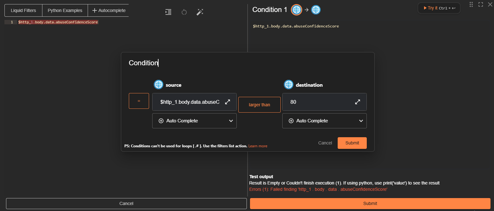
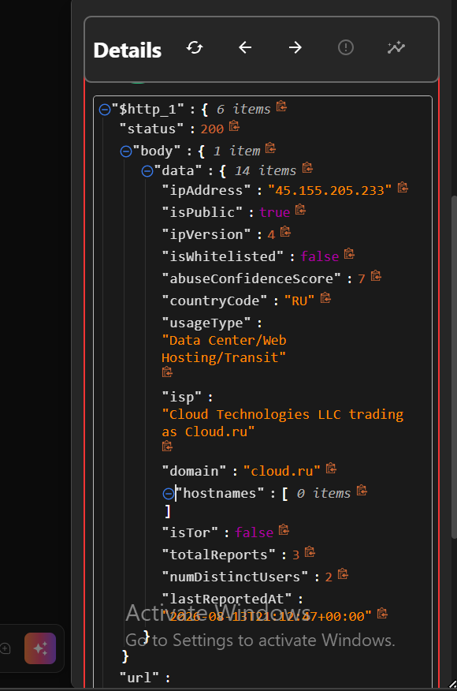
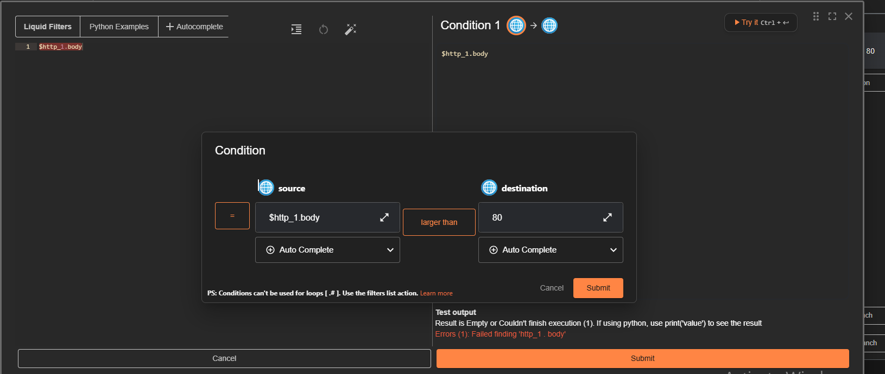

**Lesson:** a tool's built-in "test" feature isn't automatically testing the thing you think it's testing — verify against real execution logs when a test result contradicts your own evidence.

---

### 13. Webhook URL silently expired

**Symptom:** A previously-working curl command suddenly returned `{"success": false, "reason": "Hook doesn't exist. Make sure to start it!"}`.

**Root cause:** The webhook had been stopped (either manually while editing other nodes, or by Shuffle's own inactivity handling) and restarting it generated a **new** webhook ID — the old URL was now permanently dead.

**Fix:** Always re-copy the current Webhook URI from the trigger node's panel immediately before testing, rather than reusing a saved/memorized URL.

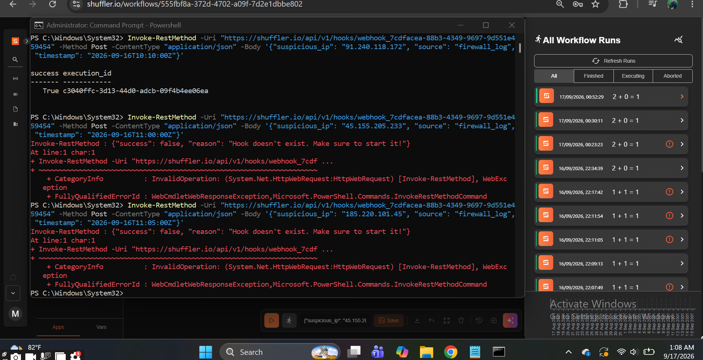
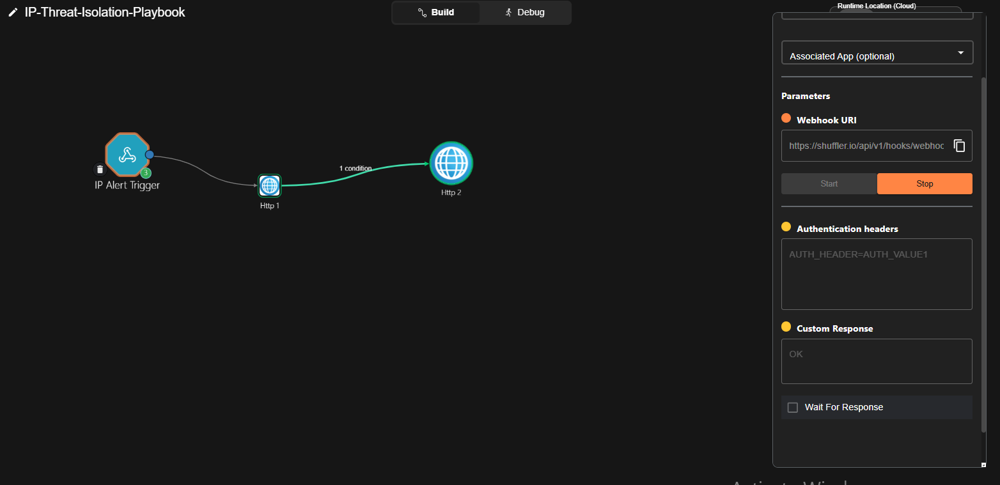

---

## Final verified result

With every issue above resolved, the workflow was proven correct in **both branches** of the condition — see the main [`README.md`](../README.md) for the final passing evidence.
